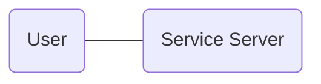
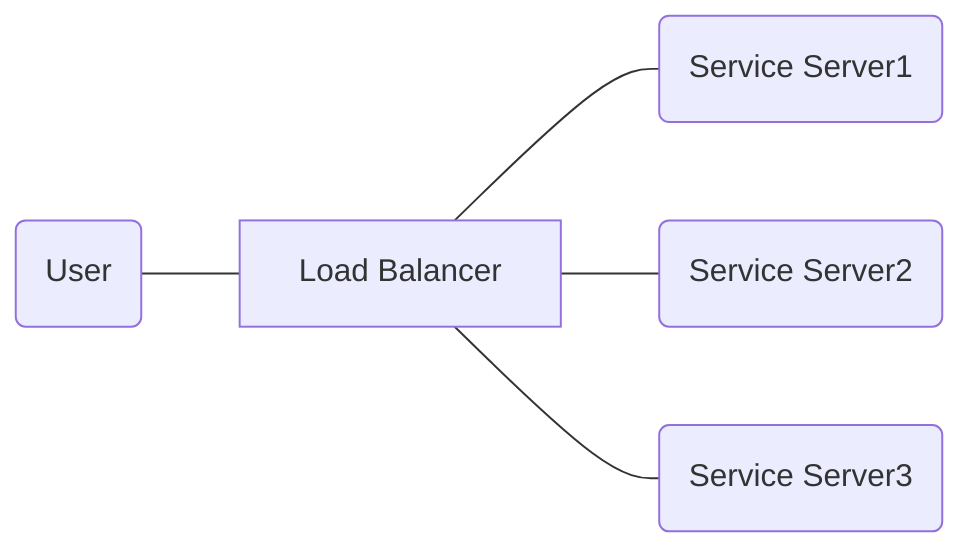

  
# Navigation Structure
{: .no_toc }

## Table of contents
{: .no_toc .text-delta }

1. TOC
{:toc}

# Gen. 0: Prototyping, Alpha Service
## Architecture

## Description
아주 초기의 웹서비스 아케텍쳐다.  
`Service Server`에서 모든 일을 다 한다.  
Front-end를 위한 웹페이지생성, 관련 리소스 제공, Back-end 작업까지 여기서 한다.  

**0세대 구조의 조건**  
1. 서비스 사용자도 적고
2. 가끔 느려지거나 다운되어도 용서받는 규모의 서비스에 적절하다.  

대학교 과제, prototype을 굳이 이 이상으로 구성할 필요는 없다.  
만약 여기서 성능이 더 필요하면 `Service Server` 장비를 좋은 걸로 교체하거나 장비 수를 늘린다.  
  
서비스가 성공하면 아래의 문제가 발생하게 된다.  
그리고 다음 세대로 넘어간다.  

### 문제1: 사용자 증가
- 사용자 증가 -> 요청 증가
  - 때에 따라 요청이 몰려서 들어오기도 한다.
- 결과: 응답속도가 느려진다. 다운되기도 한다.
- 결과: 사장이 갈군다. 팀원들이 도와줄 건 없냐고 물어본다.

### 문제2: 서비스의 기능 증가
- 기능 수/데이터량 증가 -> 연산량 증가
- 결과: 응답속도가 느려진다. 다운되기도 한다.
- 결과: 사장이 갈군다. 팀원들이 도와줄 건 없냐고 물어본다.

### 문제정의: 올려야 하는 품질
- 사용자가 많아도 느려지면 안된다.
- 사용자가 몰려도 느려지면 안된다.
- 서비스가 멈추면 안된다.

# Gen. 0.1: Load Balancer의 출현
## Architecture

## Description  
사실 이정도면 어느정도 안정적인 서비스가 가능하다.  
세 대의 Service Server는 모두 동일한 기능을 제공하고 LB(Load Balancer)가 부하를 1/n에 가깝게 분산시킨다.  

**장점**  
`Service Server1`이 동작이 불가능해도 두 대가 남아있기 때문에 서비스는 정상동작한다.  
동작이 불가능한 상황은 여러가지가 있다. 배포, S/W 고장, H/W 고장이 일반적이다.  

단, 부하가 적더라도 두 대는 위험하다. 처음부터 세 대로 시작한다.  
두 대로 클러스터를 구성하면 1번 서버가 서비스 중이지 않을 때 2번 서버가 200%의 요청을 처리해야 하기 때문이다. 그러면 높은 확률로 2번 서버는 죽는다.  

non-blocking/async service라서 죽을 가능성이 낮다고 가정해봐도  
서비스 서버가 단 한대만 살아있다면 그 순간 SPOF(Single Point Of Failure)가 생겨버리는 것이다.  
그 서버에 운 나쁘게 다른 문제가 발생한다면 남아있는 서버는 없다.  
그리고 운 나쁜 상황은 100% 내가 휴가중일 때 발생한다.  
  
서비스가 더 성장하려면 새로운 기능을 추가하게 된다.  
물론 새로운 문제는 세트메뉴다.  

### 문제1: 기능 증가로 인한 배포 증가
- 문제가 생길 정도로 기능이 늘어났다 -> 개발자가 늘어난 것
- Front-end 배포 -> back-end 담당자들도 대기 및 모니터링
	- 반대 상황도 동일
- 결과: 내가 모르는 일을 책임져야 한다. 내 업무가 아닌데 회사에 남아야 한다.
	- 근데 배포가 새벽이라면? 버그수정이라면? 직원들 간에 불필요한 마찰이 생긴다.

### 문제2: 프로그램이 복잡해져 서비스 버그 증가
- 문제가 생길 정도로 기능이 늘어났다 -> 프로그램 크기가 늘어난 것. 많이.
- 한 프로젝트 내에 모든 코드가 모여있으면 module화가 된 것도 안 된 것도 있게 된다.
	- 개발자 한둘이 잘 해놓아도 인수인계가 안되거나 신입이 망가뜨리거나 귀찮아지거나 하기 마련이다.
	- 결국 아주 tight한 coupling이 발생한다.
	- 이제는 기능/모델 하나를 수정하고 싶어도 여기저기에서 문제가 발생한다.
- 프로그램 수정시도 -> 하나 고쳤는데 버그가 세 개 생김 -> 근데 내가 모르는 버그가 있을 수도 있음 -> 서비스 나가면 무조건 문제 생김 -> 나는 무조건 휴가중임 -> 대응 늦음
- 결과: 개발자는 뭐 하나 수정하면 편히 잠을 못잔다. 남이 수정하면 잠을 더 못잔다.
- 결과: 사장님과 통화도 하고 또 혼난다. 휴가복귀해서 작업하면 팀원들이 측은한 눈빛을 보낸다.
  
### 문제정의: 올려야 하는 품질
- 기능이 많아져도 코딩이 쉬워야 한다.
- 기능이 많아져도 버그가 없어야 한다.
- 죽으면 안된다. 서비스도, 나도.
- 휴가중 사장과의 전화통화를 없앤다. 팀원들을 내가 돕고 싶다.

이제 이 구조로는 회사의 성장이 어렵다. 다음 세대로 넘어가자.

